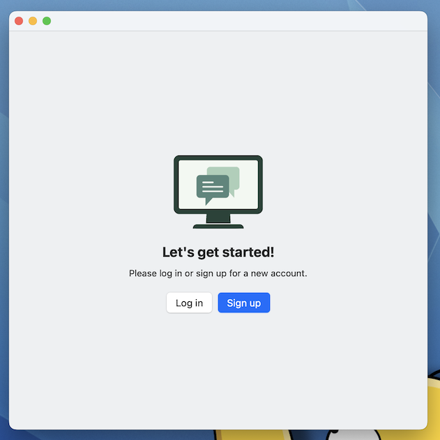
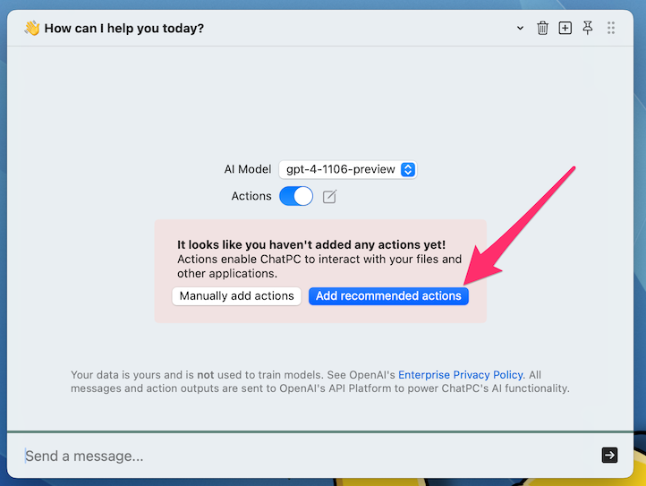
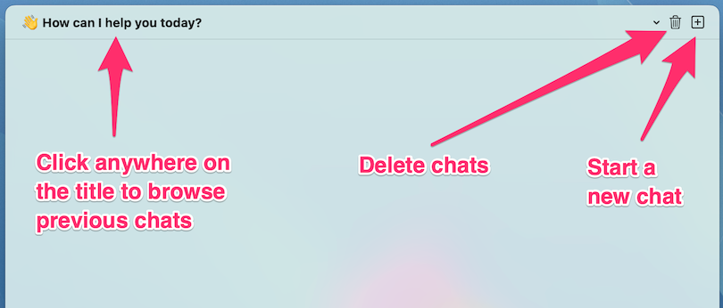
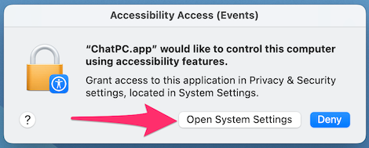
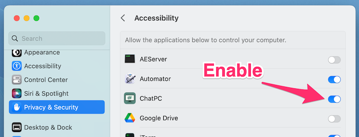
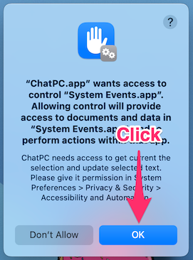

# Getting Started

## Download ChatPC

<div class="download-section" markdown>
[Download for macOS &nbsp; :octicons-download-16:](https://github.com/dounan/chat-pc-site/releases/download/v0.43/ChatPC.v0.43.zip){ .md-button .md-button--cta } <br> _Requires macOS 13.0 or higher_{ .caption }
</div>

1. Unzip the downloaded .zip file.

1. Move the `ChatPC` application to your `Applications` folder.

1. Go to your `Applications` folder and open the `ChatPC` application.

1. The app will appear in the MacOS menu bar at the top right of your screen.

    

1. A signup window will appear.

    

1. Click the `Sign up` button and click `Continue` in the popup. This will open a sign up window in your web browser.

    

1. Follow the instructions on the sign up page.

## Add recommended actions

Actions allow ChatPC to interact with your local computer and interact with other native applications.

When you first open the chat window, you'll be presented with an option to add the recommended actions.



Actions can be managed in the ChatPC settings `Actions` tab.

Note that the more actions you add, the more credits you will consume per chat message.

## Try out some prompts!

Open the chat window, and enter the following prompt:

```
Create a new folder on my desktop named after today's date
```

Approve the action to create the folder. Then enter the following prompt:

```
Write a short haiku and save it in that new folder as poem.txt
```

Approve the action to create the file. Then enter the following prompt:

```
Open the poem file
```

## Manage your chats

1. Use the title bar to start a new chat, view previous chats, and delete chats.

    

## Grant permissions

1. As you use ChatPC, you may be prompted for additional permissions as needed:

    - `Accessibility features` (you can change this setting anytime in your Mac's `System Settings` > `Privacy & Security` > `Accessibility`)

        

        

    - `"ChatPC.app" wants access to control...` (you can change these settings anytime in your Mac's `System Settings` > `Privacy & Security`)

        

## Open the chat window

If you closed the chat window, you can open it any time by clicking the ChatPC icon in the MacOS menu bar. Any selected text in the frontmost window will be pre-populated into the chat input.


## Subscription plans

The default free plan has a lifetime credit limit as well as other limitations. You can manage your subscription plan in the app settings.

Check out the [available subscription plans](https://chatpc.ai/plans).

With a subscription plan, you can enter your own OpenAI/Anthropic API keys to avoid using your ChatPC credits. You can set your API keys under `Settings > General > Personal API Keys`.

## Support

If you run into any issues or have any questions, please reach out to us at <a href="mailto:support@chatpc.ai" target="_blank">support@chatpc.ai</a>.
